The qckfx Agent SDK is built around four core concepts that work together to create powerful AI agents capable of interacting with code, files, and systems. This overview introduces each concept and shows how they interconnect to enable sophisticated agent behaviors.

## The Four Core Concepts

<CardGroup cols={2}>
  <Card title="Agent Architecture" icon="robot" href="/concepts/agent">
    The Agent class provides the main interface for creating and managing AI agents, including configuration, model management, and event handling.
  </Card>
  
  <Card title="Session Management" icon="comments" href="/concepts/sessions">
    Sessions maintain conversation context, track tool executions, and preserve state across multiple queries for natural interaction flow.
  </Card>
  
  <Card title="Tool System" icon="wrench" href="/concepts/tools">
    Tools enable agents to interact with the external world through file operations, command execution, search capabilities, and custom extensions.
  </Card>
  
  <Card title="Environment Types" icon="server" href="/concepts/environments">
    Execution environments determine where and how tools run, with local execution being the primary supported option.
  </Card>
</CardGroup>

## How They Work Together

The four concepts form an integrated system where each component plays a specific role:

### 1. Agent as the Orchestrator

The **Agent** serves as the central orchestrator, managing all interactions:
- Receives natural language queries from users
- Analyzes queries to determine required actions
- Coordinates tool execution through sessions
- Manages model interactions and response generation

### 2. Sessions Provide Context

**Sessions** maintain the conversational context and state:
- Track conversation history across multiple queries
- Preserve tool execution results for reference
- Manage token usage and performance metrics
- Enable rollback and error recovery capabilities

### 3. Tools Execute Actions

**Tools** perform the actual work requested by users:
- Read, write, and edit files in the project
- Execute shell commands and scripts
- Search and discover content across codebases
- Extend capabilities through custom implementations

### 4. Environments Enable Execution

**Environments** provide the runtime context for tool execution:
- Local execution for direct, fast operations
- Isolation options for security-sensitive scenarios
- Consistent interfaces across different deployment models

## High Level Data & Control Flow

```mermaid
---
config:
  layout: dagre
  look: handDrawn
---
flowchart TD
 subgraph subGraph0["Shadow Commit"]
        G1["Snapshot Git State"]
        G["Create Shadow Commit"]
        G2["Create Tagged Commit"]
        G3["Bundle for Rollback"]
  end
    A["User Request"] --> B["AgentEngine"]
    B --> C["FSM Driver"]
    C --> D["Model Call"]
    D --> E{"Tool Needed?"}
    E -- No --> F["Final Response"]
    E -- Yes --> G
    G --> H["Execute Tool"] & G1
    H --> I["Add Result to Context"]
    I --> D
    F --> J["Return to User"]
    G1 --> G2
    G2 --> G3
    style G fill:#23211E
    style A fill:#1A1A23
    style J fill:#141914
```



## Quick Start Example

Here's how all four concepts work together in a simple example:

```typescript
import { Agent } from '@qckfx/agent';

// 1. Create an Agent with configuration
const agent = await Agent.create({
  config: {
    environment: 'local',           // Environment: local execution
    defaultModel: 'claude-sonnet-3-7',
    tools: ['file_read', 'file_edit', 'bash']  // Tools: enable specific capabilities
  }
});

// 2. Process a query (Session automatically managed)
const result = await agent.processQuery(
  "Read the package.json file and add a new dependency for lodash"
);

// The agent will:
// - Use the Session to maintain context
// - Select appropriate Tools (file_read, file_edit)
// - Execute tools in the Local Environment
// - Return a natural language response
```

## Key Benefits of This Architecture

### Modularity
Each concept is self-contained but works seamlessly with others, allowing for flexible configuration and extension.

### Consistency
The unified interfaces ensure predictable behavior across different tools, environments, and session states.

### Extensibility
Custom tools, specialized agents, and different execution environments can be added without changing core functionality.

### Reliability
Session management, error handling, and rollback capabilities provide robust operation even in complex scenarios.

## Understanding the Flow

A typical agent interaction follows this flow:

1. **User Query** → Agent receives natural language input
2. **Query Analysis** → Agent determines what tools and actions are needed
3. **Session Context** → Agent accesses conversation history and state
4. **Tool Selection** → Agent chooses appropriate tools for the task
5. **Environment Execution** → Tools run in the configured environment
6. **Result Integration** → Tool results are added to session context
7. **Response Generation** → Agent synthesizes a natural language response

## Advanced Capabilities

When these concepts work together, they enable sophisticated behaviors:

### Multi-Step Operations
Sessions preserve context across multiple tool executions, enabling complex workflows that build on previous results.

### Error Recovery
Session rollback capabilities combined with tool error handling provide robust recovery from failures.

### Performance Optimization
Batch tool execution, prompt caching, and efficient session management optimize performance for complex tasks.

### Custom Extensions
The tool system allows for domain-specific capabilities while maintaining consistent integration with agents and sessions.

## Next Steps

To dive deeper into each concept:

<CardGroup cols={2}>
  <Card title="Start with Agent Architecture" href="/concepts/agent">
    Learn how to create, configure, and manage agents with different models and capabilities.
  </Card>
  
  <Card title="Understand Sessions" href="/concepts/sessions">
    Explore how sessions maintain context and enable sophisticated conversation flows.
  </Card>
  
  <Card title="Master the Tool System" href="/concepts/tools">
    Discover built-in tools and learn how to create custom tools for your specific needs.
  </Card>
  
  <Card title="Choose Your Environment" href="/concepts/environments">
    Understand the trade-offs between local, Docker, and remote execution environments.
  </Card>
</CardGroup>

Or jump straight into practical usage:

- **[Get Started](/get-started)** with step-by-step setup instructions
- **[Configuration Guide](/get-started/configuration)** for detailed setup options
- **[SDK Reference](/sdk)** for complete API documentation
- **[Applications](/applications)** for real-world usage examples

The combination of these four concepts—Agent architecture, session management, the tool system, and execution environments—provides a powerful foundation for building sophisticated AI agents that can understand, reason about, and modify codebases and systems.
